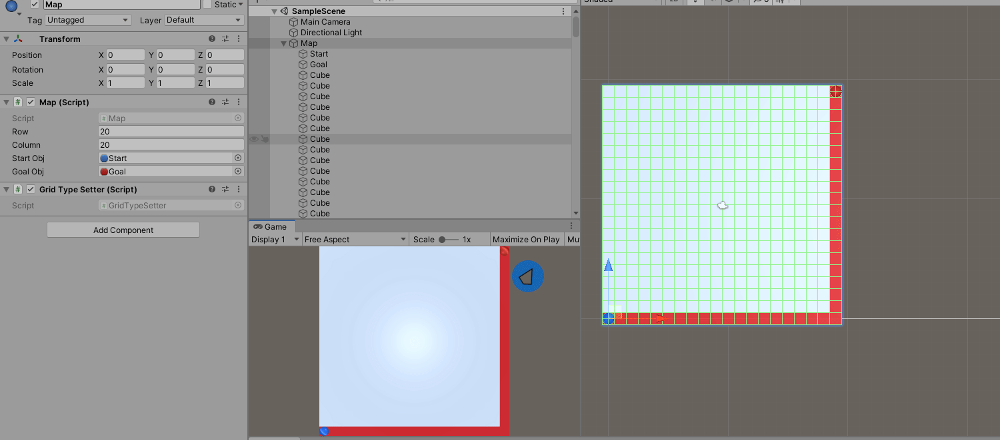

# A* implementation with a grid based pathfinding sample  
  

# How to use  
Both derived your own Node implements INode and your own graph implements IGraph,  
then just call astar.Search(yourGraph, yourStartNode, yourGoalNode) and it'll find no more than one result.  
NOTE:the result includes both startNode and goalNode!  

# The sample
Unity version: 2019  
You can drag both the start and goal GameObject in game view to reset them to one of any other map grid,  
click map grid to reset it to obstacle or passable, resize the map row/column in the Inspector.  
Those operations can be done in runtime, so you can see the result conveniently.  

A*算法的学习和实现。继承INode和IGraph接口实现自己所需要的数据，就可以调用AStar.Search(graph, start, goal)进行搜索了。  
寻路示例实现了一个网格地图的寻路，可以在运行过程中拖动start/goal节点来重新设置它们，点击地图格子将其设置障碍物或普通格子，  
动态改变地图的宽高。然后就可以看到A*的寻路结果了。控制台有打印A*查找过的节点个数。  

A*是由图的广度优先搜索演变而来的，由于广度优先搜索是均匀遍历图的所有节点，所以比较耗时。然后给地图节点加上权重后，就演变成了迪杰斯特拉算法，　　
它会优先根据当前搜索节点到起始点的最小权重去扩散搜索，而不是均匀扩散搜索。这样相对广度优先搜索就少搜索一些节点了，但速度仍较慢。然后有一个
Greedy-Best-First-Search启发式搜索，它是根据当前节点到目标节点的预估值（离目标点越近，值越小），因此它只朝着那些离目标点“更近”的节点　　
去搜索，但是如果有障碍物挡在前面的话，该算法就会绕远路，导致最后的结果可能并非最优解。刚好，A*解决了这几个问题，它“承前启后”，既关心当前节点　　
距起始节点的“距离”又预估到目标节点的值，结合起来确定下一步的搜索，这样遍历的节点更少，也可以得到最优解。　　
是搜索实现A*需要注意几个点：

一是启发式函数Heuristic()的设计，太大的话会变成上面说的那个GBFS搜索，太小会变成迪杰斯特拉搜索，为0就是广度优先搜索了，一般不用真实的两点距离。
二是Open列表，因为每次插入待查找节点时需要把最小预估值排最前面，直接用List存的话，每次都要Ｏ(n)的时间去确定插入位置。最好的方法是用最小堆
实现的优先队列来储存，因为它插入的时间复杂度是Ｏ(logn)，判断Contains()的话是Ｏ(1)，可以极快提高A*搜索速度。
三至于close列表，它是用来存放已查找过的节点的，用HashSet就可以了，但是这样为了可以回溯查找的路径，需要在Node结构中额外保存一个Previouse
的节点记录。如果不想保存这个额外的Previouse节点，可以用Dictionary代替HashSet，并将当前节点的相邻节点作为键，将当前节点作为值，这样也可
以回溯到查找过的路径。
　　
A*不止用来寻路，还可以用在角色AI的GOAP系统中，只要你设置好Heuristic()函数，并将角色的Action”建成一张图“（通过一个Action可以获取到它相邻的　　
Action），就可以为角色决策出最优的一序列Action了。
